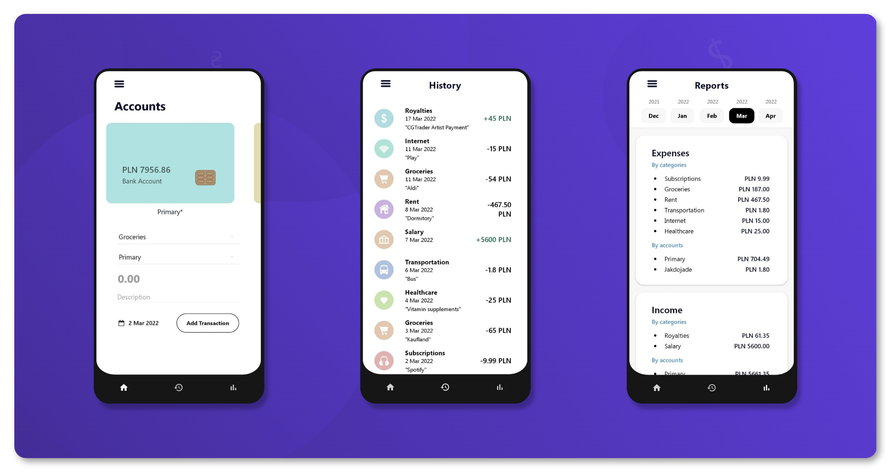
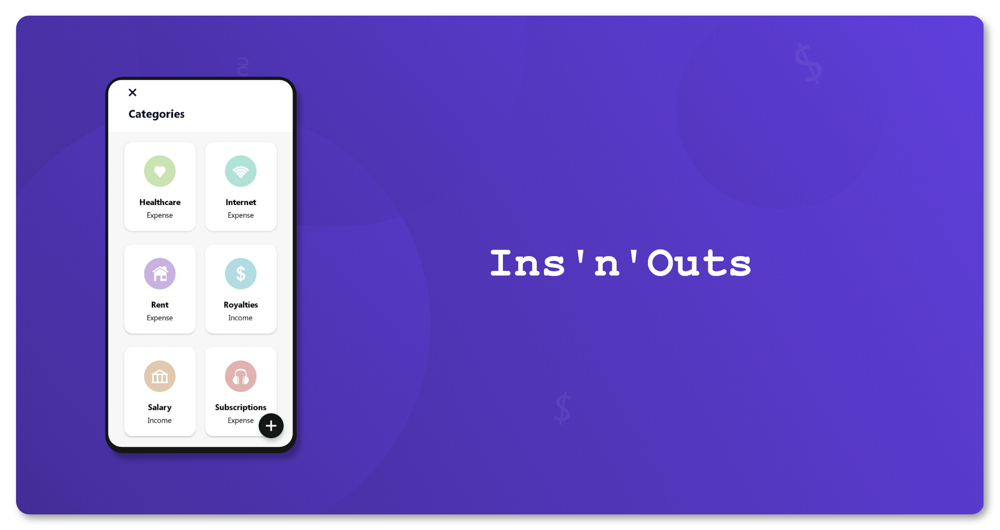

# Ins'n'Outs

A personal budgeting app. It's simple. As you buy a cup of coffee or receive a royalty payment, just enter that in application, it will do the rest for you:
- Store all incomes/expenses in a convenient history list;
- Generate detailed monthly reports based on Incomes/Expenses by Accounts/Categories;
- Create & save a PDF report of the month you request so you can share/store it.

## What have I learned during the development?

* [ROOM Database](https://developer.android.com/jetpack/androidx/releases/room) - All the CRUD operations
* Fragments and Navigation
* Recycler Layout - How to populate it with the data from the database.
* Generating files
* Comparing to my previous app ([Weather](https://github.com/andriybobchuk/Weather)) - much cleaner architecture. I.e. all files are splitted between Activities, Adapters, Dialogs, Fragments, Room, and Util packages to make it understandable for other developers. 

## Getting Started

You will be able to dowload an .AAB file for yourself a bit later.

### Permissions

- Write to external storage -> For saving PDF reports

## Built with

* [Kotlin](https://kotlinlang.org/) - The programming language used
* Android Studio, API level 30 - Environment
* Adobe XD - For the UI designing
* [Dexter](https://github.com/Karumi/Dexter) - For simpler permission handling
* [itextpdf](https://github.com/itext/itextpdf) - For generating PDF files

## Author

* **Andriy Bobchuk** - [andriybobchuk.com](https://andriybobchuk.com)

## License

This project is licensed under the MIT License - see the [LICENSE.md](LICENSE.md) file for details
